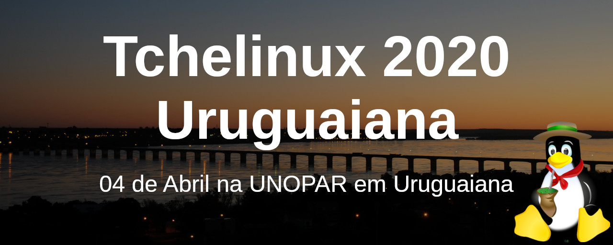
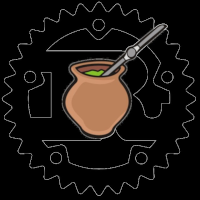
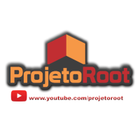
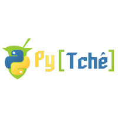

## Sobre

O grupo de usuários de Software Livre Tchelinux, em parceria com a [UNOPAR](https://www.unopar.com.br/), tem o prazer de convidar a comunidade para participar do evento que ocorrerá no dia **4 de Abril de 2020 a partir das 8:30h** na UNOPAR em Uruguaiana.

## Chamada de Trabalhos

A **Chamada de Trabalhos está aberta** e o prazo para submissão de propostas de palestra é **06 de Março de 2020**. Os trabalhos escolhidos serão anúnciados no dia 07 de Fevereiro de 2020.

<a href="https://uruguaiana.tchelinux.org/cfp/" style="color:#ff4040"><b><h3>Clique aqui e submeta sua palestra!<h3></b></a>

## Inscrições

As inscrições já se encontram abertas e podem ser feitas através do link abaixo: 

<a href="https://uruguaiana.tchelinux.org/inscricoes/" style="color:#ff4040"><b><h3>Clique aqui e faça já a sua inscrição! Vagas limitadas!<h3></b></a>

O evento tem **entrada franca**, porém os participantes são encorajados a doar 2kg de alimentos não perecíveis (exceto sal), que são doados a instituições de caridade da região. Os alimentos são recebidos no momento do credenciamento.

## Certificados

Serão fornecidos certificados digitais para os participantes do evento, que confirmaram sua presença. Para obtê-los, você deverá utilizar o email fornecido na sua inscrição para o evento.

**Importante:** Não esqueça de confirmar sua presença no credenciamento.

## Local

> **UNOPAR Uruguaiana**
> Rua Duque de Caxias, 3148
> São Miguel
> Uruguaiana - RS

  <iframe src="https://www.google.com/maps/embed?pb=!1m18!1m12!1m3!1d13853.19933290104!2d-57.09759830218864!3d-29.768970526988273!2m3!1f0!2f0!3f0!3m2!1i1024!2i768!4f13.1!3m3!1m2!1s0x94535b38fddddbfd%3A0xd4741d6f7cbb0880!2sR.%20Duque%20de%20Caxias%2C%203148%20-%20S%C3%A3o%20Miguel%2C%20Uruguaiana%20-%20RS%2C%2097502-772!5e0!3m2!1sen!2sbr!4v1581830218368!5m2!1sen!2sbr" width="800" height="600" frameborder="0" style="border:0;" allowfullscreen=""></iframe>

## Apoio

### Institucional

### Patrocínio

### Divulgação

